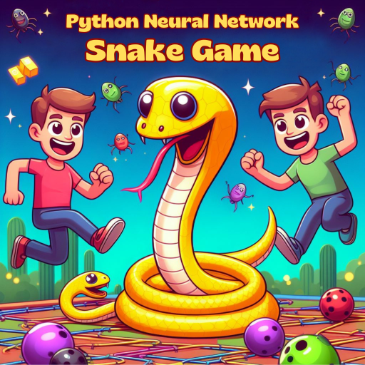

# Snake Game AI

## Overview

This repository contains the implementation of a Snake game with an AI agent using the Monte Carlo Tree Search (MCTS) algorithm. The project is organized into the following files:

- `game.py`: Implements the Snake game logic.
- `helper.py`: Provides helper functions for visualization during training.
- `model.py`: Defines the neural network model for Q-learning and the QTrainer class for training.
- `agent.py`: Contains the Agent class responsible for training the AI using Q-learning.



## Requirements

- Python 3
- Pygame
- Matplotlib
- Torch

## Getting Started

1. **Clone the repository:**
    ```bash
    git clone https://github.com/SantosProgramming/SnakeAIpy
    cd SnakeAIpy
    ```

2. **Install dependencies:**
    ```bash
    pip install -r requirements.txt
    ```

3. **Run the game:**
    ```bash
    python agent.py
    ```

## How to Play

To train the Snake game AI, execute the `agent.py` file:

```bash
python agent.py
```

This will start the training process, and you can observe the game's progress through the visualization.

## Files

### `game.py`

Contains the implementation of the Snake game, including the game state, game logic, and AI-controlled Snake.

### `helper.py`

Provides a plotting function (`plot`) for visualizing the training progress during the AI training.

### `model.py`

Defines the neural network model (`Linear_QNet`) for Q-learning and the `QTrainer` class for training the model.

### `agent.py`

Contains the `Agent` class responsible for training the Snake game AI using Q-learning. It includes methods for getting the game state, training the model, and making decisions.

## Acknowledgments

The implementation of the Snake game AI is inspired by various online resources and tutorials. Special thanks to the open-source community for providing valuable insights and knowledge.

Feel free to explore, modify, and enhance the code as needed!